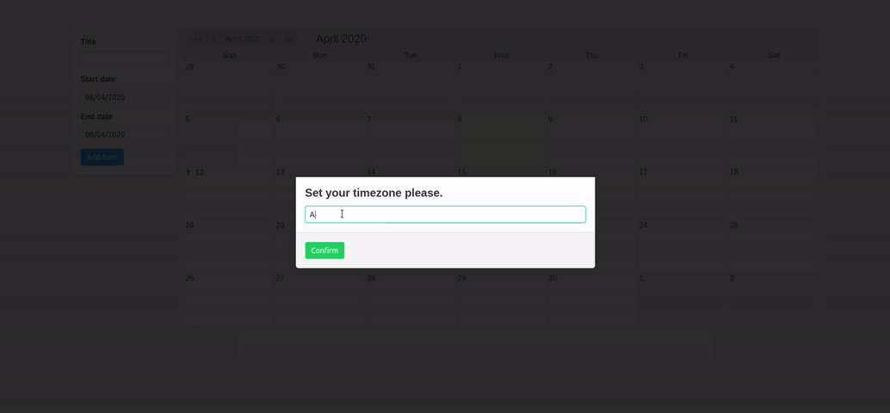

# calendar

A calendar web-app made for practice with time.

## Installation

```
git clone https://github.com/youngkaneda/calendar
cd calendar
# now you need enter the service dir compile it and run with an 
# suitable application server (i used payara micro)
cd calendar-service
mvn clean package
java -jar [path]/payara-micro.jar --deploy target/calendar-service.war
# now with the websocket deployed you need to install and run the 
# front-end app
cd ../calendar-front
npm install
npm run serve
# now go to the localhost:port link deployed by npm
```

## Features

1. Create date and time based events.
2. The client will show a a noitification when the event is up to begin.
3. A daily task will schedule notifications for the day.
4. *Nothing more, it's just a calendar after all.*

## Limitations

1. To connect with the websocket you need pass a time zone as parameter.
2. I used localstorage to save the time zone, but if you use private tabs and stuff, you will need set again every time you open the web app.
3. Using different time zones on each connection maybe not lead to internal errors (I'll test it), but can confuse you when the notifications come when you don't expect.
4. About missed events, when you web app is closed and the server send a message with a notification, you will not receive any notification about it, I'm planning to implement a solution for it, show to the client after him/her connect, all the missed events through warning notifications.

## Motivation

The mainly reason to create this project was study and use java time api's and work with time zones and offsets, and in the way i could practice websockets and Vue.js.

## Demonstration



---

Feel free to fork and contribute.